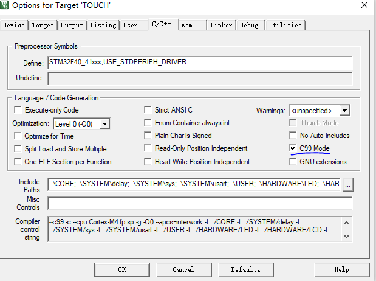
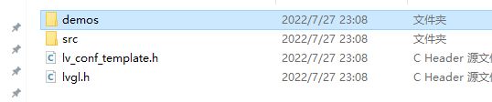

1. example准备


- heap size 改到2K以上
- 编译选项 C99
- timer 添加

2. LVGL 准备

- 源码添加lvgl文件夹
- lv_conf.h文件添加
- lv_conf.h文件修改
- main.c里面添加对应的调用

3. dis 显示修改
4. 


--------------

准备文件：


## example等材料准备

首先我用的是F407 探索者开发板详细资料见

http://www.openedv.com/docs/boards/stm32/zdyz_stm32f407_explorer.html

### LVGL

1. lvgl： https://github.com/lvgl/lvgl/tree/release/v8.3

   这边选择zip包就行 

### F407

这边选择的是例程 `实验28 触摸屏实验`  这边选择的是标准库版本。

这个例程既有LCD显示，也有触摸。比较适合做example

### example修改

example需要做如下修改

#### **heap size** 

修改成2K以上, 在startup_stm32f40_41xxx.s文件中

```
Stack_Size      EQU     0x00001000
```

#### **编译选项C99**

要选择C99



#### **添加timer驱动**

需要设置timer handler 为1ms触发一次，并调用`lv_tick_inc(1)`

由于这个时候lvgl还没添加进来，所以先注释掉

```
void TIM3_IRQHandler(void)
{ 		    		  			    
	if(TIM3->SR&TIM_IT_Update)
	{
		//lv_tick_inc(1);
	}				   
	TIM3->SR = (uint16_t)~TIM_IT_Update;
}
```

总之这一步需要一个timer定时器。其他开发板可以参考类似的操作。

初始化TIMER

```
TIM3_Int_Init(999,83);	//定时器初始化(1ms中断),用于给lvgl提供1ms的心跳节拍
```

#### main清理

清理掉main.c里面其他无用的函数只保留下面的内容

```
int main(void)
{ 
	NVIC_PriorityGroupConfig(NVIC_PriorityGroup_2);
	delay_init(168);  
	uart_init(115200);		
	LED_Init();				
 	LCD_Init();					
	KEY_Init(); 				
    TIM3_Int_Init(999,83);	
	tp_dev.init();				
 	while(1)
	{
	}
}
```


## LVGL 添加步骤

### 删掉多余文件

解压lvgl.zip文件，其他文件都不需要我们保留下面的文件

demos里面保留benchmark这个demo就可以了

```
├─demos
│  └─benchmark
│      └─assets
│─src
│─lvgl.h
└─lv_conf_template.h
```





### 修改lvgl_conf.h 文件

需要修改lv_conf_template.h文件重命名lv_conf.h

### 添加lvgl 相关头文件和源文件

```
src/core          //全部添加
src/draw          //一级目录下面全部添加
src/draw/sw       //全部添加
src/extra         //一级目录
src/extra/layout/flex
src/extra/layout/grid
src/front          //全部添加
src/hal            //全部添加
src/misc           //全部添加
src/widgets        //全部添加
```

### 添加lv_init()调用

在main.c初始化部分调用`lv_init()`

```
	lv_init();			
 	while(1)
	{
		lv_timer_handler();
	}
```

### 把time注释打开

```
void TIM3_IRQHandler(void)
{ 		    		  			    
	if(TIM3->SR&TIM_IT_Update)
	{
		lv_tick_inc(1);
	}				   
	TIM3->SR = (uint16_t)~TIM_IT_Update;
}
```

编译可以看到，没有问题

### lvgl example 添加

这边以`demos/benchmark` 为例需要添加文件夹下面的所有.c源文件

在main.c中调用`lv_demo_benchmark()` 来启动demos

其他demo需要确定lv_conf.h里面的宏是否打开

```
/*Benchmark your system*/
#define LV_USE_DEMO_BENCHMARK 1
```


## LVGL porting  dis 添加

porting文件在`example\porting`里面

这边文件系统可以先不用管，输入设备也可以暂时不用管，就看lv_port_disp*等文件

这边就要做一些#if 0 改为#if 1 等修改了，具体可以参考commit

https://github.com/supperthomas/LVGL_F407_PORING_GUID/commit/3bbf301506002c4c86f62af3cf91132f71a1f94f#diff-f4334e6cf10e080fecc992041c243f1c6823fb9ab63bfef349494d0e2ce4bb4b

另外在main.c中添加函数`lv_port_disp_init();` 调用


##  修改分辨率

通过宏来修改分辨率

```
    #define MY_DISP_HOR_RES    480
    #define MY_DISP_VER_RES    800
```

烧入之后，会发现benchmark可以跑起来了。


